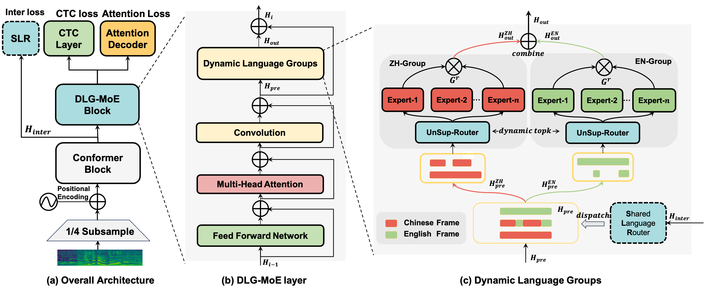

# [Dynamic Language Group-Based MoE: Enhancing Code-Switching Speech Recognition with Hierarchical Routing](https://arxiv.org/abs/2407.18581)


- The configuration file for the experiment is located in `./conf`.
- The package details for the experimental conda environment are listed in `./environment_packages.txt`.
- The source code for this experiment can be found in `./src/DLG-MoE`.
- The logs are available in `./exp`.

## Introduction
We implement a highly flexible MoE model, based on the proposed hierarchical routing and dynamic language expert groups, which allows us to flexibly carry out the design of the expert group according to the actual needs and to choose different topk for inference in order to realize the trade-off between performance and speed. And since we are based on the U2++ architecture, we also support streaming inference with different chunksizes.
## Train && Infer
You just need to prepare the dataset and place it in the `./data` and run the following command to reproduce our experiment.
```
bash train.sh
bash infer.sh
```
## Discussion
The following are the points we believe still require further research.
- Experiments on More Languages: Additional experiments will be conducted on more languages.

- Exploring Expert Allocation: Investigate the effect of assigning different numbers of experts to different languages.

- Language Group Strategy: For major languages, language groups could be used, while resource-scarce languages might share group parameters, simplifying model design.

- Adaptive Top-k: Investigate the model’s ability to adaptively adjust the top-k value based on the input.

- Balancing Loss for Load Distribution: When expanding the number of experts (e.g., more than 8 per group), adding a balancing loss in the MoE may be necessary to ensure load balancing, which remains to be explored.

Our code is primarily modified from [wenet](https://github.com/wenet-e2e/wenet) version 2.0


If you find this repository helpful for your research, please cite our work:

```bibtex
@article{huang2024dynamic,
  title={Dynamic Language Group-Based MoE: Enhancing Code-Switching Speech Recognition with Hierarchical Routing},
  author={Huang, Hukai and Lu, Shenghui and Shan, Yahui and Qu, He and Guan, Wenhao and Hong, Qingyang and Li, Lin},
  journal={arXiv preprint arXiv:2407.18581},
  year={2024}
}