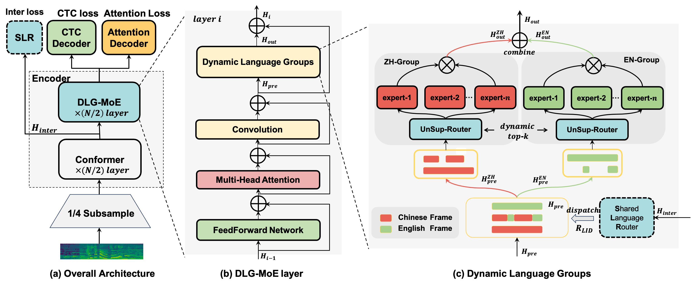

# [Dynamic Language Group-Based MoE: Enhancing Efficiency and Flexibility for Code-Switching Speech Recognition](https://arxiv.org/abs/2407.18581)


- The configuration file for the experiment is located in `./conf`.
- The package details for the experimental conda environment are listed in `./environment_packages.txt`.
- The source code for this experiment can be found in `./src/Group-MoE`.
- The logs are available in `./exp`.

## Introduction
We implement a highly flexible MoE model, based on the proposed dynamic language expert group, which allows us to flexibly carry out the design of the expert group according to the actual needs and to choose different topk for reasoning in order to realize the trade-off between performance and speed. And since we are based on the U2++ architecture, we also support streaming inference with different chunksizes.
## Train && Infer
You just need to prepare the dataset and place it in the `./data` and run the following command to reproduce our experiment.
```
bash train.sh
bash infer.sh
```
Our code is primarily modified from [wenet](https://github.com/wenet-e2e/wenet) version 2.0